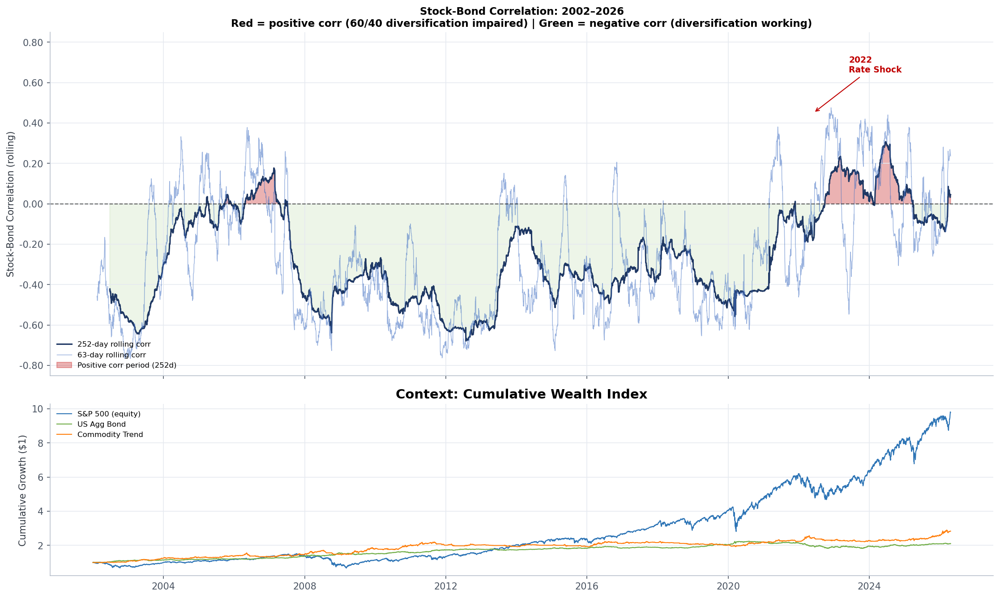
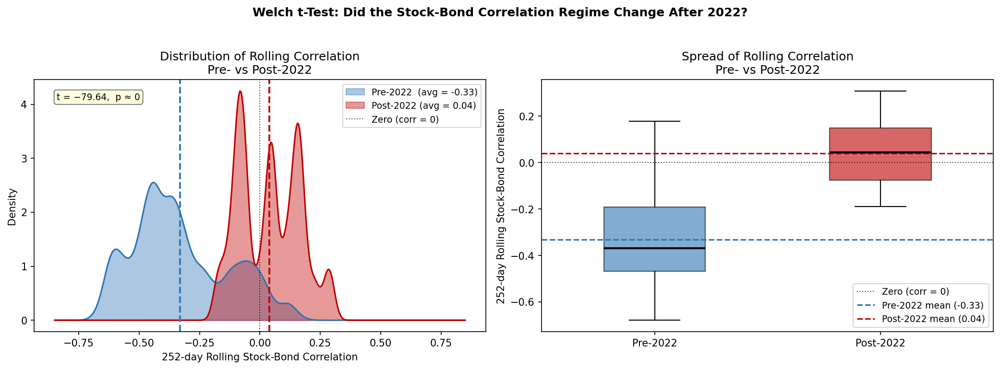
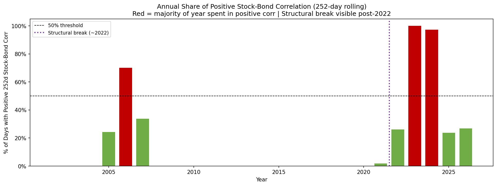
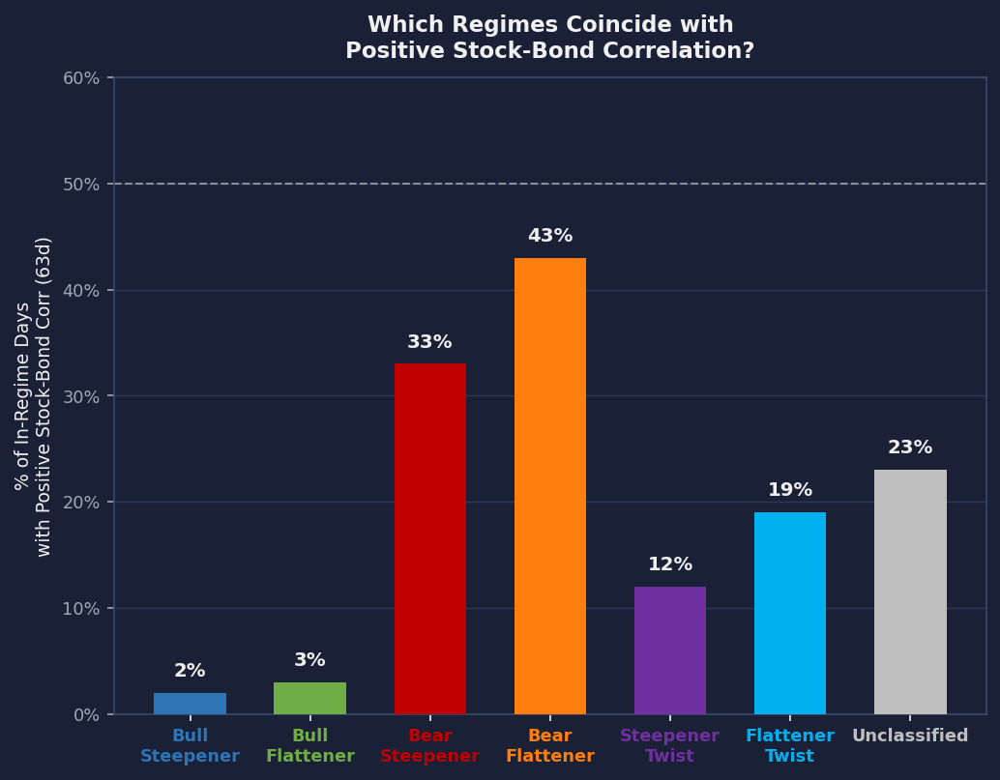
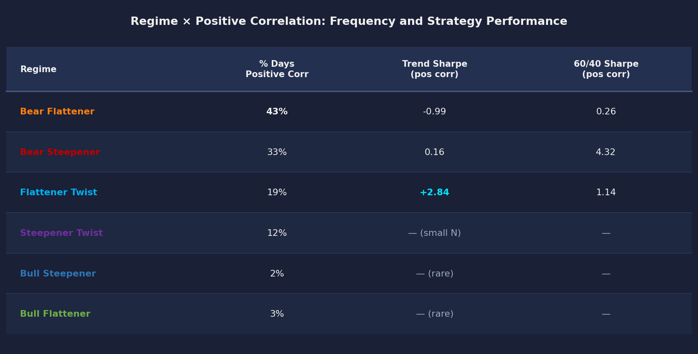

# Stock-Bond Correlation: What It Means for 60/40 and the Case for Trend

Two interlocking questions drive this analysis:

1. **Has the pre-2022 negative stock-bond correlation era ended structurally?** Or was 2022 just a spike?
2. **Which yield-curve regimes drive the correlation breakdown — and what is the macroeconomic mechanism?**

---

## Section 1 — The Correlation Landscape

The entire 60/40 diversification thesis rests on stocks and bonds moving in opposite directions. That premise held cleanly before 2022 and broke during and after the rate-hike cycle.

**The structural break is statistically unambiguous:**

- **Pre-2022:** average 252-day rolling correlation = **–0.33** | only **7%** of trading days in positive-corr territory
- **Post-2022:** average = **+0.039** | **59%** of trading days with positive correlation
- Welch t-test (H₀: same mean): **t = –79.64, p ≈ 0** — the null of an unchanged regime is rejected decisively

The **left panel (KDE)** shows where each group's rolling-correlation values are centered — the blue pre-2022 mass sits firmly in negative territory, the red post-2022 mass has shifted toward zero and positive. The **right panel (box plots)** shows the full spread and median of each group; the dashed lines mark each group mean. The gap between the two means is what the t-test is formally quantifying.

---

## Section 2 — Regime × Correlation Interaction

The correlation break in Section 1 tells us the *overall* problem. This section goes one level deeper: **which specific yield-curve regimes are responsible, and why does the inflation and rate mechanism cause stocks and bonds to move together in those regimes?**

**Share of in-regime days with positive 63-day stock-bond correlation, and strategy performance in those days:**

| Regime | % Days Positive Corr | Trend Sharpe (pos corr) | 60/40 Sharpe (pos corr) |
|---|---|---|---|
| Bear Flattener | **43%** | –0.99 | 0.26 |
| Bear Steepener | 33% | 0.16 | 4.32 |
| Flattener Twist | 19% | **+2.84** | 1.14 |
| Steepener Twist | 12% | — (small N) | — |
| Bull Steepener | 2% | — (rare) | — |
| Bull Flattener | 3% | — (rare) | — |

---

### Why Bear Flattener (43%) — The Fed Hiking Mechanism

**Bear Flattener** = both yields rising, but **short rates rising faster than long rates**, so the curve flattens in a rising-yield (bear) environment. This is the canonical aggressive Fed-hiking regime.

The macro chain is direct:

1. Inflation runs hot → the Fed hikes the policy rate rapidly
2. Short yields surge (anchored to Fed funds rate), long yields rise but lag
3. Rising yields mean **bond prices fall** across the curve — the bond leg of 60/40 is being hit
4. Simultaneously, higher discount rates **compress equity valuations** — the stock leg of 60/40 is also hit
5. Both assets are responding to the **same driver** — the inflation/rate signal — so they fall together

This is precisely the 2022 playbook: CPI peaked at 9%, the Fed hiked 525 bps in 12 months, and both the S&P 500 and the US Aggregate Bond Index posted their worst simultaneous losses in decades. At 43% of its days in positive-corr territory, Bear Flattener is the regime where the 60/40 diversification thesis most visibly breaks.

**But note**: Trend Sharpe = –0.99 here. Trend also struggles in this cell, because the strong USD driven by aggressive Fed hiking pressures commodity prices and EM currencies simultaneously — the same mechanism that breaks 60/40 also hurts Trend's commodity and FX positions.

---

### Why Flattener Twist (19%) — The Inflation Uncertainty Mechanism

**Flattener Twist** = short rates rising while long rates fall (or stay anchored), causing the curve to invert via a "twist." This is a transition regime — the Fed is tightening, but the long end is pricing in that hiking will eventually slow growth and force rate cuts.

The positive-correlation mechanism here is subtler:

1. The Fed is still fighting inflation — short rates rise, keeping short-term bond prices under pressure
2. Long rates fall as growth fears accumulate — long bonds rally
3. The aggregate bond index is mixed, but **equity markets are simultaneously volatile** because the inverted curve historically signals recession
4. Inflation data surprises in either direction move **both assets in the same direction**: a hot CPI print spikes long yields (both bonds and stocks sell off), a weak growth print rallies bonds and hits stocks — but during periods of elevated macro uncertainty, the inflation signal dominates and correlation turns positive

**This is the standout cell for Trend**: Sharpe = **+2.84** vs 60/40 at 1.14. The regime is turbulent enough that clear price trends form across commodities and EM FX — precisely what a momentum strategy is built to exploit. The 19% positive-corr frequency means this combination is not rare enough to dismiss.

---

### Reading the Two Regimes Together

| | Bear Flattener | Flattener Twist |
|---|---|---|
| **Positive corr frequency** | 43% — most common | 19% — meaningful |
| **Why corr turns positive** | Fed hiking crushes both legs of 60/40 via the same rate signal | Inflation uncertainty dominates; macro surprises move stocks and bonds in sync |
| **Trend performance** | Sharpe –0.99 — Trend also hurt | Sharpe +2.84 — Trend thrives |
| **Portfolio implication** | Both 60/40 and Trend struggle; no easy hedge | 60/40 impaired, but Trend provides a genuine replacement diversifier |

The practical takeaway: **not all positive-corr regimes are equally dangerous, and Trend is not a universal fix.** The Flattener Twist × positive-corr cell is where the case for Trend is strongest — the hedge works precisely when it is needed. The Bear Flattener cell is the honest caveat: when inflation is severe enough to break both assets simultaneously, Trend's commodity sleeve is also under pressure.

---

## Summary

| Finding | Key Numbers | Implication |
|---|---|---|
| **Structural correlation break** | Pre-2022: avg –0.33, 7% positive days → Post-2022: avg +0.039, 59% positive days (p ≈ 0) | The pre-2022 negative-corr era that made 60/40 efficient has ended; this is not a transient spike |
| **Bear Flattener drives the breakdown** | 43% of Bear Flattener days have positive corr — highest of any regime | Fed hiking compresses both asset legs via the same rate signal; this is the most dangerous regime for 60/40 |
| **Flattener Twist is the opportunity** | 19% positive-corr frequency, Trend Sharpe = 2.84 vs 60/40 Sharpe = 1.14 | When inflation uncertainty inverts the curve, Trend provides the diversification that bonds can no longer supply |

### Caveats
- Sample: Jan 2002 – Apr 2026 (6,340 trading days). Positive-corr windows cover ~25% of the full sample; conditional cells with small N (< 150 days) carry wide uncertainty.
- The post-2022 average correlation of +0.039 reflects a sustained regime shift, not just the 2022 spike — partial reversion in 2023–2026 is still well above the pre-2022 baseline.
- Trend holds only 4 assets; a broader mandate could differ in specific episodes.
