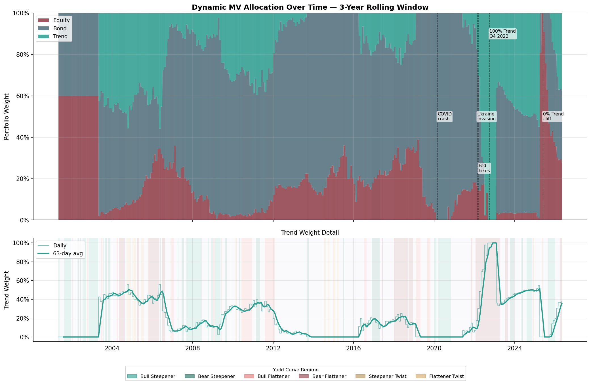
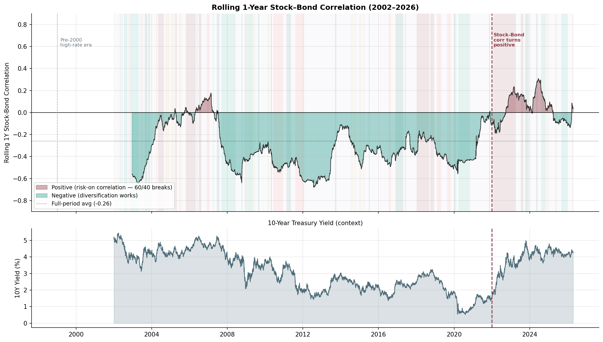
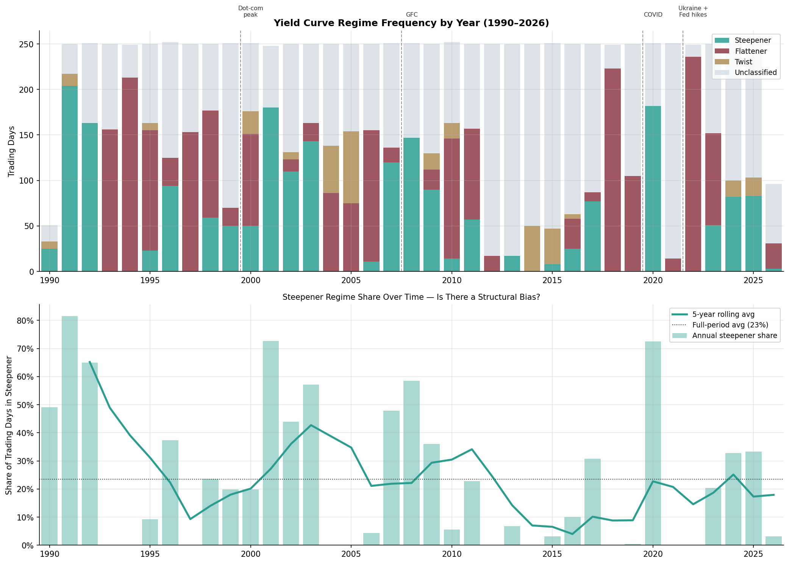
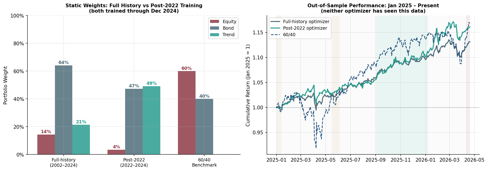
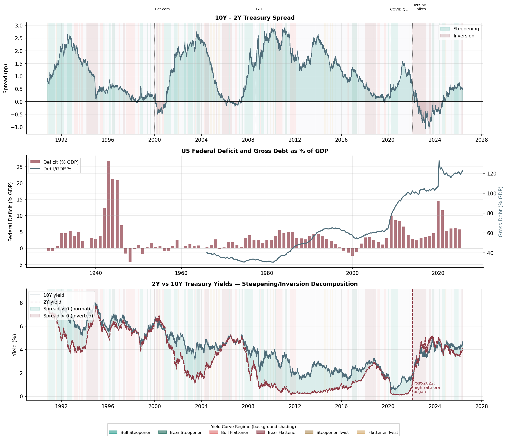

# Structural Regime Shift Investigation

Three interlocking questions drive this analysis:

1. **Why does the MV optimizer give Trend low allocation?** How has that shifted since 2020?
2. **Did 2022 represent a structural correlation break?** Ukraine invasion + rate-hike cycle changed stock/bond dynamics.
3. **Does deficit/debt dynamics support a steepening bias?** If so, what does that imply for Trend?

---

## Trend Allocation Over Time

The dynamic MV optimizer re-solves monthly on a rolling 3-year window. This means it reacts to history with a lag and "forgets" periods as they age out. The 2022 Bear Flattener was exceptional for Trend; as 2022 rolls out of the lookback window in 2025, Trend loses its track-record support.

---

## Commodity-Trend Model Performance by Regime

The core finding is that the model's alpha is not evenly distributed — it is heavily concentrated in just two regimes:

**Bull Steepener** (short rates falling, curve steepening):
- Trend Sharpe: 1.73 vs 60/40 Sharpe: 0.81
- Information Ratio: +0.32 (consistently positive active return)
- Avg correlation to 60/40: 0.12 (low — good diversification)
- 60/40 is more underwater on average (–7.1%) than Trend (–5.3%)

**Flattener Twist** (short rates rising faster than long rates, curve inverting):
- Trend Sharpe: 2.12 vs 60/40 Sharpe: 0.34
- Information Ratio: +0.89 (the most consistent outperformance of any regime)
- Correlation to 60/40: ~0.001 (essentially zero — maximum diversification)

Bear Steepener and Bull Steepener are the sticky regimes — when you enter them you tend to stay. Steepener Twist is fleeting (avg 17 days, rarest by episode count), more of a transitional state than a sustained environment.

### The Key Surprise: The Dynamic MV Allocates Counter-Intuitively

The optimizer gives Trend its lowest weight in Bull Steepener (only 8.4% avg), which is Trend's best regime, and its highest weight in Bear Flattener (44%), which is one of Trend's worst.

This is not a bug. The MV optimizer doesn't care about Trend's standalone Sharpe — it cares about how Trend interacts with stocks and bonds in the portfolio. In Bear Flattener, Trend has low correlation to equities and bonds, so it provides maximum diversification value even if its own return is weak. In Bull Steepener, everything performs well together and Trend is just another correlated asset — the optimizer doesn't need it.

This is exactly the distinction between Sharpe alone being insufficient — the optimizer is rewarding diversification, not raw performance.

---

## Correlation Structural Break (2022)

For decades, stocks and bonds had a negative correlation (~-0.27 on average), making 60/40 an efficient portfolio. In 2022, that correlation flipped positive — for the first time since the late 1990s. When stocks and bonds move together, Trend becomes the only true diversifier in the portfolio. The MV optimizer is slow to incorporate this structurally because of its backward-looking window.

Trend is the only asset in the 3-asset portfolio that provides genuine diversification when stock-bond correlation is positive — which is the core argument for why the backward-looking MV optimizer is underweighting it relative to what a forward-looking view would suggest.

---

## Regime Frequency Evolution

The steepening bias thesis claims that deficit and debt dynamics will structurally push long yields up relative to short yields, biasing the curve toward steepening regimes. The chart below examines the historical frequency of steepener vs flattener regimes by decade.

---

## Sub-Period MV Analysis

### Full History vs Post-2022 Training (Out-of-Sample)

The full-history optimizer is trained on 20+ years of data dominated by a negative stock-bond correlation era (~-0.38 pre-2022), which made bonds look like excellent diversifiers and suppressed Trend's marginal contribution.

To investigate, the optimizer was retrained using only post-COVID / post-Ukraine data (Jan 2022–Dec 2024) — the new regime where stock-bond correlation broke positive — and both were evaluated out-of-sample on Jan 2025–present (neither optimizer has seen this data).

| Training Window | Equity | Bond | Trend | Sharpe (OOS) | Max DD |
|---|---|---|---|---|---|
| Full-history (2002–2024) | 14% | 64% | 21% | 2.13 | -3.3% |
| Post-2022 (2022–2024) | 4% | 47% | 49% | 2.09 | -3.5% |
| 60/40 Benchmark | 60% | 40% | 0% | 1.15 | -10.9% |

The post-2022 optimizer made a dramatically different bet — trading bond weight (64% → 47%) for trend (21% → 49%), with barely any equity either way. The post-2022 version "learned" from a world where stock-bond correlation was positive, so it leaned on trend as the diversifier instead of bonds.

The most important feature in the right panel is the crash in March–May 2025 (the tariff shock). 60/40 dropped ~7% while both optimizers barely moved — entirely explained by equity exposure: 60/40 had 60% in stocks, the optimizers had 4–14%. The trend and bond positions cushioned the blow.

After the dip, all three recovered, and by April 2026 they're clustered around +15–17% cumulative. The difference is not in total return — it's in the path. The optimizers delivered the same final number with roughly a third of the drawdown (-3.3% vs -10.9%).

---

## The Steepening Bias Thesis

### Two Paths to Steepening

**Bear steepener — the market-driven channel.** Long yields rise (10Y goes up) because investors demand more compensation to absorb Treasury supply, while short yields are anchored by the Fed. The spread widens because the 10Y rises faster than the 2Y.

**Bull steepener — the Fed-driven channel.** The Fed eventually cuts short rates to ease debt servicing costs or support growth, while long yields stay high because markets still price in the fiscal risk premium. The spread widens because the 2Y falls faster than the 10Y.

### Why This Matters for Trend

Trend earns its best Sharpe in Bull Steepener (1.73) and reasonable returns in Bear Steepener (0.56). Bonds perform poorly in a bear steepener (they're the thing selling off) and give up the diversification benefit in a bull steepener (since everything rallies together).

The backward-looking MV optimizer doesn't know this — it looks at the last 3 years of data and weights by diversification benefit, not by where the macro regime is heading. If steepening is the structural direction, the optimizer is systematically underweighting Trend relative to where a forward-looking allocation would land.

### Reading the Three Panels

**Panel 1 — 10Y minus 2Y spread (the yield curve shape)**

This is the raw signal. When the line is above zero the curve is normal/steepening; when it dips below, the curve has inverted — historically a recession signal.

- The curve spent most of 1990–2019 in positive territory, with brief inversions around dot-com (2000) and GFC (2007–08)
- The post-COVID inversion (2022–2023) was the deepest in the dataset — nearly -1.1pp — driven by the fastest Fed hiking cycle in 40 years
- Right now (~+0.5pp) the curve has re-steepened and is back in positive territory

**Panel 2 — Deficit and debt as % of GDP (the structural pressure)**

This is why steepening is likely to persist.

- The bars (deficit/GDP) show that outside of wartime and COVID, deficits are now structurally larger than at almost any peacetime period in history — running ~6% of GDP with no recession in sight
- The line (debt/GDP) shows the cumulative effect: debt has gone from ~60% of GDP in 2008 to 123% today, and the trajectory is still rising
- The mechanism: to fund persistent large deficits, the Treasury has to keep issuing long-duration bonds. That supply pressure pushes long yields up and widens the spread

**Panel 3 — 2Y and 10Y yields separately (which leg is driving)**

This decomposes the spread into its two components. Both yields rose sharply post-2022, but the 2Y rose faster initially (Fed-driven), causing the inversion. Now as the Fed holds or cuts, the 2Y is moderating while the 10Y stays elevated — that's the re-steepening in Panel 1.

The key forward-looking point: if the fiscal thesis holds, the 10Y has a structural floor (term premium from supply) while the 2Y will eventually fall as the Fed responds to slower growth. That is the bull steepener channel — the regime where Trend earns its best historical Sharpe of 1.73 and where the MV optimizer would be expected to increase allocation.

---

## Summary

| Question | Finding |
|---|---|
| **Why low Trend allocation?** | MV optimizer is correlation-driven, not performance-driven. In good regimes (Bull Steepener), everything rallies together — Trend's diversification value drops, so does its weight. The 3Y window also lagged the 2022 Bear Flattener benefit and caused a cliff in 2025 when 2022 rolled off. |
| **Did 2022 break correlation structure?** | Yes. Stock-bond correlation flipped from ~-0.27 (20-year avg) to positive during 2022 — the first time since the late 1990s. Trend was the only true diversifier during the break. |
| **Does steepening bias justify more Trend?** | The historical regime data does not yet show structural steepening dominance, but the forward thesis is plausible: rising debt supply → term premium repricing → structural steepening pressure. In a steepening world, Trend's expected Sharpe (1.73 in Bull Steepener) is significantly higher than bonds'. A higher Trend floor than what the backward-looking MV prescribes is defensible. |
